# Advanced Lane Finding Project  

## Introduction  

## Files

[`main.py`](main.py) : main code  
[`calibration.py`](calibration.py) : get calibration matrix  
[`threshold.py`](threshold.py) : sobel edge & hls color  
[`finding_lines.py`](finding_lines.py) : find & draw lane lines with sliding widow search   [`challenge_video`](challenge_video.mp4))

## The goals / steps of this project are the following:

* Compute the camera calibration matrix and distortion coefficients given a set of chessboard images.
* Apply a distortion correction to raw images.
* Use color transforms, gradients, etc., to create a thresholded binary image.
* Apply a perspective transform to rectify binary image ("birds-eye view").
* Detect lane pixels and fit to find the lane boundary.
* Determine the curvature of the lane and vehicle position with respect to center.
* Warp the detected lane boundaries back onto the original image.
* Output visual display of the lane boundaries and numerical estimation of lane curvature and vehicle position.

---

## Camera Calibration

#### When a camera looks at 3D objects in the real world and transforms them into a 2D image, it's not perfect because of a distortion. And the distortion brings an erroneous information.(e.g. changed object shape, bent lane lines) So, we have to undo the distortion for getting useful data.

The code for camera calibration step is contained in the [`calibration.py`](calibration.py).  

I compute the camera matrix(intrinsic parameters) and distortion coefficients using the `cv2.calibrateCamera()` function with 20 9*6 sized [chessboard images](camera_cal). And applied this distortion correction to the test image using the `cv2.undistort()` function.  

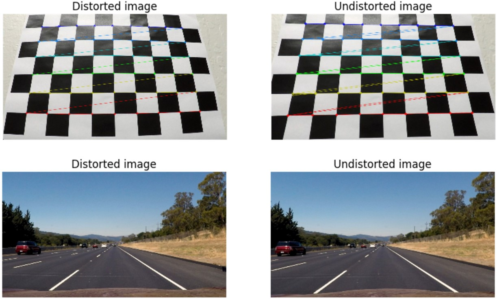

## Pipeline  

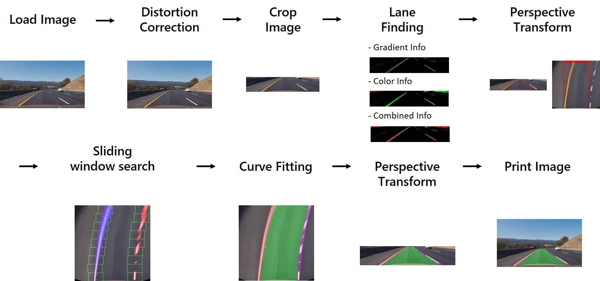

If an image loaded, we immediately undo distortion of the image using calculated calibration information.

### 1. Crop Image  

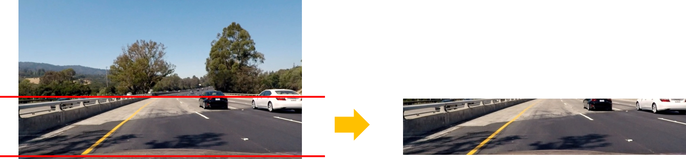

In image, a bonnet and background are not necessary to find lane lines. Therefore, I cropped the inconsequential parts.  

### 2. Lane Finding  

I used two approaches to find lane lines.  
a **Gradient** approach and a **Color** approach.
The code for lane finding step is contained in the [`threshold.py`](threshold.py).  

In gradient approach, I applied Sobel operator in the x, y directions. And calculated magnitude of the gradient in both the x and y directions and direction of the gradient. I used red channel of RGB instead of grayscaled image.  

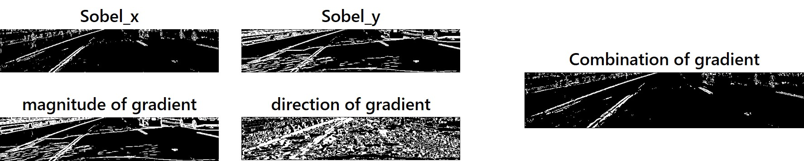

In Color approach, I used red channel of RGB Color space and H,L,S channel of HSV Color space. Red color(255,0,0) is included in white(255,255,255) and yellow(255,255,0) color. That's way I used it. Also I used HLS Color space because we could be robust in brightness.  

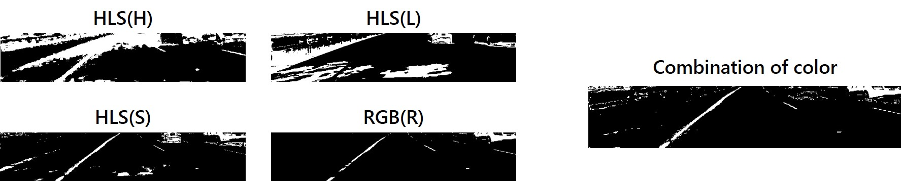

This is combination of color and gradient thresholds.  

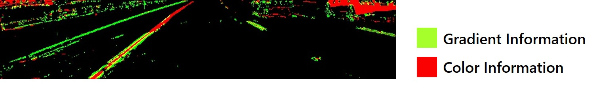

### 3. Perspective Transform  

 We can assume the road is a flat plane. Pick 4 points of straight lane lines and apply perspective transform to the lines look straight. It is also called `Bird's eye view`.  

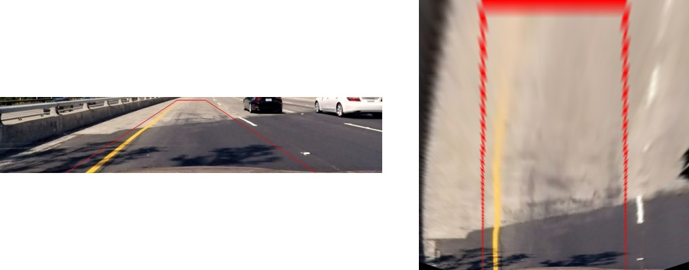

### 4. Sliding Window Search  

The code for Sliding window search is contained in the [`finding_lines.py`](finding_lines.py) or [`finding_lines_w.py`](finding_lines.py).  

In the video, we could predict the position of lane lines by checking previous frame's information. But we need an other method for a first frame.  

In my code, if the frame is first frame or lost lane position, found first window position using histogram. Just accumulated non-zero pixels along the columns in the lower 2/3 of the image.  

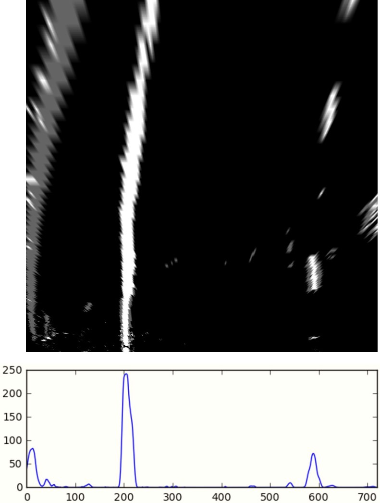

In the course, we estimated curve line by using all non-zero pixels of windows. Non-zero piexels include **color information** and **gradient information** in bird's eyes view binary image. It works well in [`project_video`](project_video.mp4).  

**But it has a problem.**  

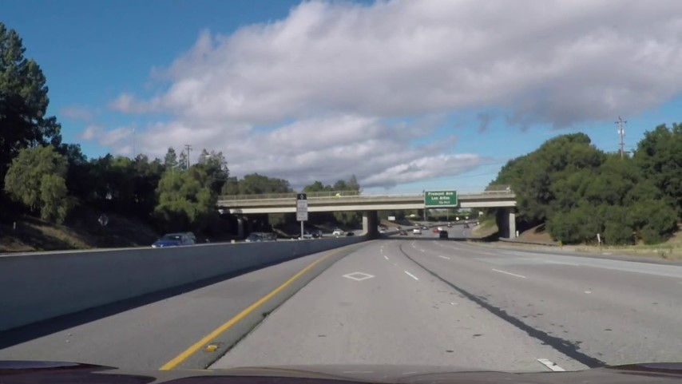

This is one frame of [`challenge_video`](challenge_video.mp4).  
In this image, there are some cracks and dark trails near the lane lines. Let's check the result.  

If we fit curve lines with non-zero pixels, the result is here.
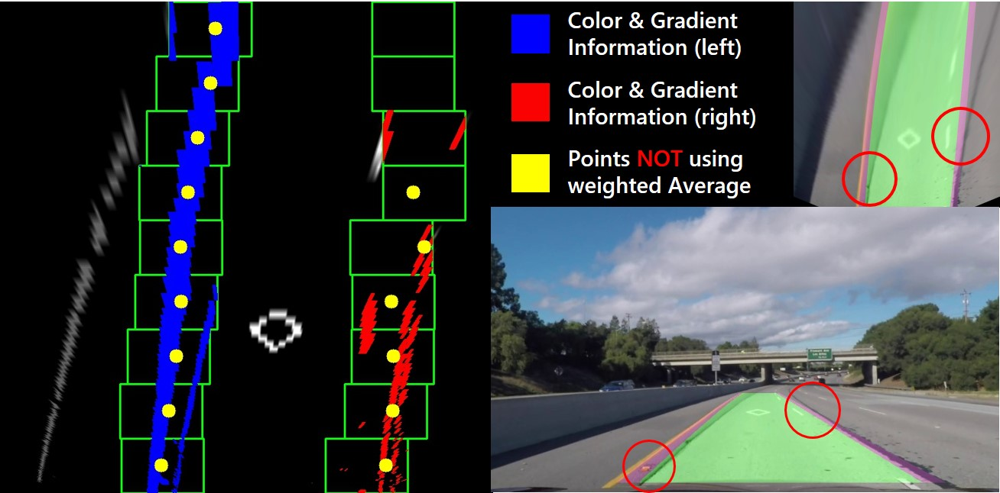
As you can see, we couldn't detect exact lane positions. Because our gradient information have cracks information and it occurs error of position.  

So, I used **`weighted average`** method.
I put **0.8** weight value to color information and **0.2** to gradient information. And calculated x-average by using weighted average in the window.
This is the result.  
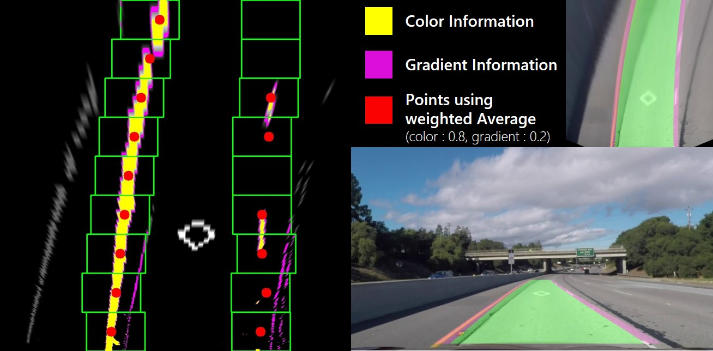

### 5. Road information  

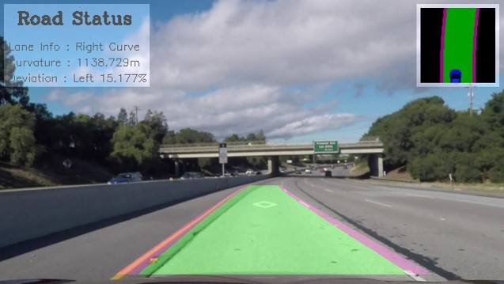  

In my output video, I included some road informations.

#### Lane Info
* estimate lane status that is a straight line, or left/right curve. To decide this, I considered a radius of curvature and a curve direction.  

#### Curvature
* for calculating a radius of curvature in real world, I used U.S. regulations that require a minimum lane width of 3.7 meters. And assumed the lane's length is about 30m.  

#### Deviation
* Estimated current vehicle position by comparing image center with center of lane line.  

#### Mini road map
* The small mini map visualizes above information.

---

## Result  
<a href="./output_images/project_video_draw.mp4">video file is here</a>

## Discussion
Due to limited conditions, I did not try extreme weather tests, and did not implement harder challenge video. I will be try it in the future.
